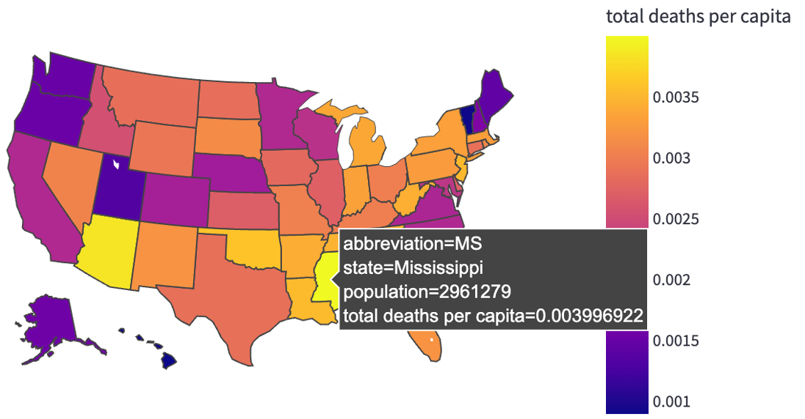

## COVID-19 Cases vs. Vaccines in the United States
By: Rachel Goodridge

### Abstract
Using data about COVID-19 cases from Johns Hopkins University (found [here](https://www.kaggle.com/headsortails/covid19-us-county-jhu-data-demographics?select=covid_us_county.csv)) and COVID vaccines from the CDC (found [here](https://github.com/owid/covid-19-data/tree/master/public/data/vaccinations)), I created an interactive website application that allows users to select and interpret various geospatial data plotted on an interactive map, create customizable dataframe queries, and observe visualizations of the changes in COVID cases and vaccines over time. It is meant to be informative to the general public, and ideally can be used to identify target locations that could benefit from public health outreach programs. I developed this app with streamlit and deployed it using GitHub. Draw conclusions and create your own interpretations by visiting the [website](https://share.streamlit.io/rachelgoodridge/data_engineering/main/streamlit/streamlit_app.py) and exploring the data.

### Design
The purpose of this project is to build an interactive website application that provides information about COVID-19 cases and vaccine rates in the United States. It is meant to be informative to the general public, as well as to health organizations. Ideally, this app can be used to identify which target states (or more specific locations) within the U.S. could benefit from public health outreach programs. For example, education and vaccination promotion could be useful in areas with high rates of disease diagnosis or death and low percentages of vaccinated individuals. 

### Data
I’ve used two main datasets and one supplementary dataset for this project. The first dataset provides daily updates of cumulative COVID cases grouped by county of each state and dates back to Jan 2020. Columns of interest include county, state, fips code, date, cumulative cases, and cumulative deaths. This data is from Johns Hopkins University and can be downloaded through [kaggle](https://www.kaggle.com/headsortails/covid19-us-county-jhu-data-demographics?select=covid_us_county.csv). As of February 19, 2022, it has over 2.5 million rows and 6 columns of data. The second dataset provides daily updates of COVID vaccines grouped by state and dates back to Jan 2021. Columns of interest include date, state, percent vaccinated, percent fully vaccinated, and percent boosted. This data is from the [Centers for Disease Control and Prevention](https://covid.cdc.gov/covid-data-tracker/#vaccinations_vacc-total-admin-rate-total) and can be downloaded through [GitHub](https://github.com/owid/covid-19-data/tree/master/public/data/vaccinations). As of February 19, 2022, it has over 26k rows and 5 columns of data. Finally, the supplementary data is the state populations from the 2020 US Census and can be found [here](https://www.populationu.com/gen/us-states-by-population).

### Algorithms
First, I wrote SQL queries to extract specific columns from these datasets. Then, I cleaned, merged, and aggregated this data to perform exploratory data analysis and create visualizations. I also performed some simple calculations such as converting cumulative counts to new daily counts and converting raw counts to counts per capita. Finally, I developed an interactive website application through streamlit and deployed this using GitHub.

### Tools
- SQL and SQLAlchemy for data storage and data queries
- numpy and pandas for data manipulation
- matplotlib and plotly for visualizations
- datetime for data type conversions
- pickle for data storage and data sharing
- streamlit and GitHub for website application production and deployment

### Communication
Through this app, users can select and interpret various geospatial data plotted on an interactive map, create customizable dataframe queries, and observe visualizations of the changes in COVID cases and vaccines over time. Comparisons can be made between the rate of COVID diagnoses/deaths and the percentage of vaccinated/boosted members of the population both over time and across the states. For example, the rate that COVID is spreading seems to be increasing, while the rate that people are receiving vaccinations seems to be slowing down. From case studies of individual states, we can determine where public health organizations might consider creating outreach programs. For example, Mississippi has the highest death rate per capita of all the states (see figure below) and it has the third lowest percentage of fully vaccinated people (roughly 50.7%). This could be a good target location for education and vaccine promotion. More conclusions like this can be drawn by using these visual aids to create your own interpretations. Find the website [here](https://share.streamlit.io/rachelgoodridge/data_engineering/main/streamlit/streamlit_app.py) to continue exploring this data.

